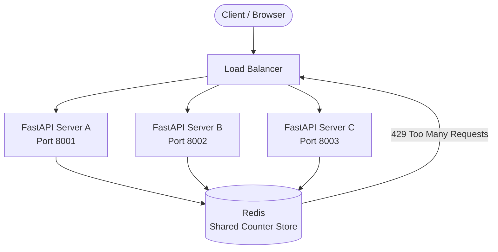

# ⚡ ThrottleX — Distributed Rate Limiting System

> A production-grade, distributed rate limiting system built with **FastAPI** and **Redis**.  
> Enforces API traffic limits across multiple backend instances using atomic Redis operations.


---
## 🌐 Live Demo
- **API Base URL:** https://throttlex-production.up.railway.app
- **Swagger Docs:** https://throttlex-production.up.railway.app/docs
- **Health Check:** https://throttlex-production.up.railway.app/health

## 📌 Overview

Most rate limiters fail at scale. When multiple backend servers run behind a load balancer, per-server counters diverge — a user can exceed limits simply by hitting different instances.

**ThrottleX solves this** by centralizing all rate limit state in Redis. Every server reads and writes the same counters atomically. The limit holds regardless of which instance handles the request.

---

## ✨ Features

- 🔢 **Three rate limiting algorithms** — Fixed Window, Sliding Window, Token Bucket
- ⚛️ **Atomic Redis operations** — `INCR`, `ZADD`, Lua scripting for race-condition-free counters
- 🔥 **Hot-reloadable config** — update limits at runtime via admin API, zero restarts needed
- 🧱 **Middleware-based** — rate limiting intercepts requests before endpoint logic runs
- 📊 **Rate limit headers** — every response includes `X-RateLimit-Limit`, `X-RateLimit-Remaining`, `Retry-After`
- 🐳 **Fully containerized** — `docker-compose up` starts the entire system in seconds
- 📈 **Load tested** — 160 RPS, p99 latency 23ms, zero 500 errors under 50 concurrent users
- 📖 **Auto-generated Swagger docs** — interactive API documentation at `/docs`

---

## 🏗️ Architecture



**Request flow:**
```
Incoming Request
    → RateLimitMiddleware intercepts
    → Extracts identifier (IP or X-User-ID header)
    → Fetches route config from Redis (or defaults)
    → Runs rate limit algorithm atomically
    → Allow (200) or Block (429)
    → Attaches X-RateLimit-* headers to response
```

---

## 🧠 Algorithms

| Algorithm | Redis Structure | Key Operations | Best For |
|---|---|---|---|
| **Fixed Window** | String counter | `INCR`, `EXPIRE` | Simple APIs, low traffic |
| **Sliding Window** | Sorted Set | `ZADD`, `ZREMRANGEBYSCORE`, `ZCARD` | Accurate per-user limits |
| **Token Bucket** | String + Lua | Atomic Lua script, `GET`, `SET` | Bursty traffic, cloud APIs |

### Fixed Window
Divides time into fixed buckets. Counter resets at window boundary.  
⚠️ Vulnerable to boundary bursts — 2x traffic possible at window edges.

### Sliding Window
Stores each request timestamp in a sorted set. On every request, evicts old entries and counts remaining.  
✅ No boundary burst. Exact accuracy. Higher memory usage O(n).

### Token Bucket
Tokens accumulate at a fixed refill rate up to a maximum capacity. Each request consumes one token.  
✅ Allows controlled bursting. Used by AWS API Gateway, Cloudflare, Nginx.  
🔒 Implemented with an **atomic Lua script** — read + calculate + write in one Redis operation.

---

## 📁 Project Structure

```
ThrottleX/
├── app/
│   ├── __init__.py
│   ├── main.py                  # FastAPI app, lifespan, middleware registration
│   ├── core/
│   │   ├── __init__.py
│   │   ├── redis_client.py      # Shared async connection pool
│   │   ├── rate_limiter.py      # All three algorithm implementations
│   │   └── config.py            # Hot-reloadable route config system
│   ├── middleware/
│   │   ├── __init__.py
│   │   └── rate_limit.py        # Request interception middleware
│   └── routes/
│       ├── __init__.py
│       ├── health.py            # Health check endpoint
│       ├── api.py               # Rate-limited test endpoints
│       └── admin.py             # Config management endpoints
├── Dockerfile
├── docker-compose.yml
├── .dockerignore
├── locustfile.py                # Load testing configuration
├── test_rate_limit.py           # Algorithm test script
├── test_config.py               # Hot-reload config test script
├── requirements.txt
└── .env
```

---

## 🚀 Setup & Installation

### Option 1 — Docker (Recommended)

Requires [Docker Desktop](https://www.docker.com/products/docker-desktop/).

```bash
# Clone the repository
git clone https://github.com/yourusername/throttlex.git
cd throttlex

# Start FastAPI + Redis together
docker-compose up --build
```

To simulate a distributed deployment with 3 FastAPI instances sharing 1 Redis:

```bash
docker-compose up --scale throttlex=3
```

Visit `http://localhost:8000/docs` for interactive API documentation.

---

### Option 2 — Local Development

**Prerequisites:** Python 3.11+, Redis running on `localhost:6379`

```bash
# Clone and enter project
git clone https://github.com/yourusername/throttlex.git
cd throttlex

# Create virtual environment
python -m venv .venv
.venv\Scripts\activate        # Windows
source .venv/bin/activate     # macOS/Linux

# Install dependencies
pip install -r requirements.txt

# Configure environment
cp .env.example .env
# Edit .env: REDIS_HOST=localhost, REDIS_PORT=6379, REDIS_DB=0

# Start Redis (if not running)
docker run -d -p 6379:6379 redis:alpine

# Run the server
uvicorn app.main:app --reload --port 8000
```

---

## 🔑 Environment Variables

| Variable | Default | Description |
|---|---|---|
| `REDIS_HOST` | `localhost` | Redis server hostname |
| `REDIS_PORT` | `6379` | Redis server port |
| `REDIS_DB` | `0` | Redis database index |

> In Docker, `REDIS_HOST` is automatically set to `redis` (the service name) via `docker-compose.yml`.

---

## 📡 API Reference

### Rate-Limited Endpoints

| Method | Endpoint | Algorithm | Default Limit |
|---|---|---|---|
| `GET` | `/api/data` | Fixed Window | 10 req / 60s |
| `GET` | `/api/sliding` | Sliding Window | 10 req / 60s |
| `GET` | `/api/bucket` | Token Bucket | capacity=10, refill=0.1/s |

### Admin Endpoints

| Method | Endpoint | Description |
|---|---|---|
| `GET` | `/admin/config` | List all active configs |
| `GET` | `/admin/config/{path}` | Get config for a specific route |
| `POST` | `/admin/config/{path}` | Update config (hot-reload) |
| `DELETE` | `/admin/config/{path}` | Reset route to default config |

### Response Headers

Every response includes rate limit metadata:

```
X-RateLimit-Limit: 10
X-RateLimit-Remaining: 7
Retry-After: 45        ← only present on 429 responses
```

---

## 🧪 Testing

### 1. Algorithm Test

Tests all three rate limiting algorithms sequentially.

```bash
python test_rate_limit.py
```

**Expected output:**

```
--- Fixed Window: /api/data ---
Request  1 → Status: 200 | Remaining: 9
Request  2 → Status: 200 | Remaining: 8
...
Request 10 → Status: 200 | Remaining: 0
Request 11 → Status: 429 | Remaining: N/A
Request 12 → Status: 429 | Remaining: N/A

--- Sliding Window: /api/sliding ---
Request  1 → Status: 200 | Remaining: 9
...
Request 10 → Status: 200 | Remaining: 0
Request 11 → Status: 429 | Remaining: N/A

--- Token Bucket: /api/bucket ---
Request  1 → Status: 200 | Tokens left: 9.0
Request  2 → Status: 200 | Tokens left: 8.2
...
Request 12 → Status: 200 | Tokens left: 0.23
Request 13 → Status: 429 | Tokens left: 0

Waiting 4 seconds for tokens to refill...
Request  1 → Status: 200 | Tokens left: 0.64
Request  2 → Status: 429 | Tokens left: 0
```

---

### 2. Hot-Reload Config Test

Verifies that rate limit config updates take effect immediately without restarting the server.

```bash
python test_config.py
```

**Expected output:**

```
--- Step 1: Check current config ---
{'/api/data': {'limit': 10, 'window': 60, 'algorithm': 'fixed'}, ...}

--- Step 2: Hit /api/data (limit=10) ---
Request 1 → 200 | Remaining: 9
Request 2 → 200 | Remaining: 8
Request 3 → 200 | Remaining: 7

--- Step 3: Hot-update limit to 2 ---
{'message': 'Config updated for /api/data', 'config': {'limit': 2, ...}}

--- Step 4: Hit /api/data again (limit now 2) ---
Request 1 → 429 | Remaining: 0
Request 2 → 429 | Remaining: 0

--- Step 5: Reset config back to default ---
{'message': 'Config reset for /api/data', 'deleted': True}
```

---

### 3. Load Test (Locust)

Simulates 50 concurrent users across all endpoints.

```bash
locust --host=http://localhost:8000
```

Open `http://localhost:8089`, set **50 users / 10 spawn rate**, start swarming.

**Results achieved:**

| Metric | Value |
|---|---|
| Total RPS | 159.8 |
| Median latency | 16ms |
| p99 latency | 23ms |
| Min latency | 2ms |
| 500 errors | 0 |

---

### 4. Health Check

```bash
curl http://localhost:8000/health
```

```json
{
  "status": "ok",
  "service": "ThrottleX",
  "redis": "connected"
}
```

---

## 🐳 Docker Details

```yaml
services:
  redis:                          # Redis 7 Alpine — lightweight, production-ready
    healthcheck: redis-cli ping   # FastAPI waits until Redis is healthy before starting

  throttlex:
    environment:
      REDIS_HOST: redis           # Service name resolves via Docker internal DNS
    depends_on:
      redis:
        condition: service_healthy
```

> **Why `REDIS_HOST=redis` and not `localhost`?**  
> Each Docker container has its own network namespace. `localhost` inside the FastAPI container refers to that container only — Redis lives in a separate container. Docker Compose creates a shared internal network where services discover each other by service name via built-in DNS.

---

## 📊 Redis Key Structure

| Key Pattern | Type | Used By |
|---|---|---|
| `throttlex:{identifier}` | String | Fixed Window counter |
| `throttlex:sliding:{identifier}` | Sorted Set | Sliding Window log |
| `throttlex:tb:tokens:{identifier}` | String | Token Bucket token count |
| `throttlex:tb:ts:{identifier}` | String | Token Bucket last refill time |
| `throttlex:config:{path}` | String (JSON) | Hot-reload config store |

---

## 🛠️ Tech Stack

| Technology | Version | Purpose |
|---|---|---|
| Python | 3.11 | Core language |
| FastAPI | 0.111.0 | Async web framework |
| Redis (asyncio) | 5.0.4 | Distributed counter store |
| Uvicorn | 0.30.1 | ASGI server |
| Starlette | — | Middleware layer |
| Locust | 2.29.1 | Load testing |
| Docker Compose | — | Container orchestration |

---

## 📄 License

MIT License — free to use, modify, and distribute.
